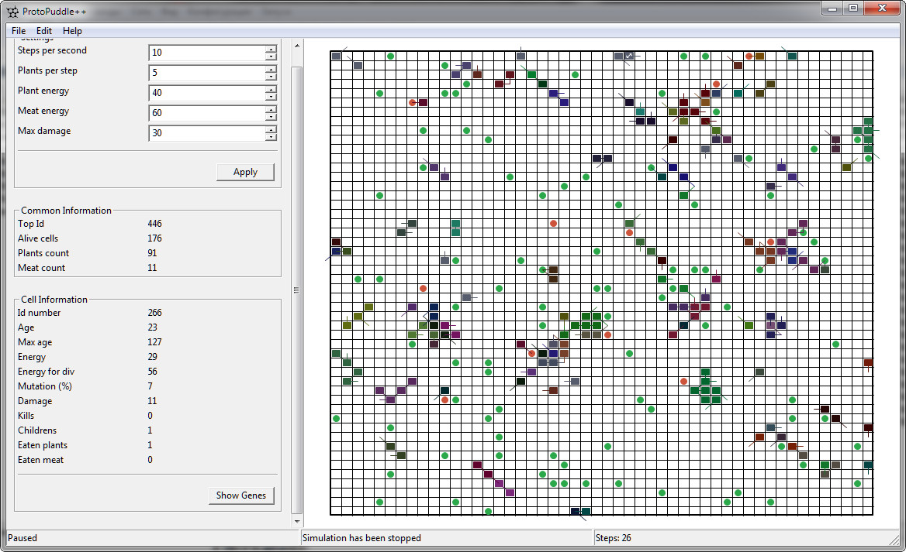

# ProtoPuddle++
A simulator of cells world. It is a remake of the original ProtoPuddle with an unique base of source code.

## Third Party
ProtoPuddle++ uses external projects enumerated below:
1. https://github.com/wxWidgets/wxWidgets/releases/tag/v3.1.3
2. https://github.com/effolkronium/random
3. https://github.com/nlohmann/json

## Build
You can use cmake for building, but it isn't crossplatform method yet. Only Windows is supported at this moment.

## Binary
Binary releases for Windows 64 bit are available. Download them from [this page](https://github.com/m110h/protopuddlepp/releases).

## Screenshot

